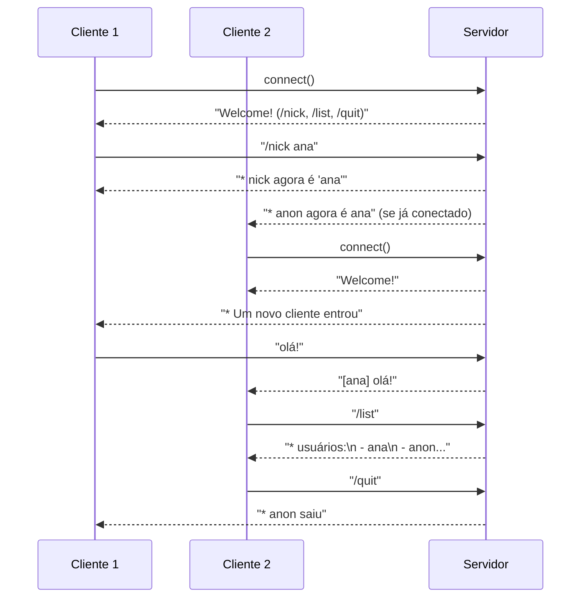

# Relatório Final — Etapa 3 (v3-final)

## 1) Visão geral

Sistema completo do **Tema A — Chat TCP multiusuário** com:
- comandos: `/nick`, `/list`, `/quit`;
- broadcast com apelido e avisos de entrada/saída;
- **logging integrado** usando a `libtslog` da Etapa 1 (fila + writer dedicado);
- scripts de execução/validação.

**Como rodar (resumo):**
```bash
make
./bin/server 9000 logs/server.log                # terminal A
./bin/client 127.0.0.1 9000 logs/a.log          # terminal B
./bin/client 127.0.0.1 9000 logs/b.log          # terminal C
# no cliente B:
#   /nick ana
#   olá!
# aparece no cliente C: [ana] olá!
```

---

## 2) Diagrama de sequência (cliente-servidor)



---

## 3) Mapeamento requisitos → código

| Requisito | Implementação |
|---|---|
| **Cliente/servidor mínimo em rede** | `src/server.c`: `socket`, `bind`, `listen`, `accept`, laço de I/O com `select()` para vários clientes.<br>`src/client.c`: `socket`, `connect`, multiplexa **stdin ↔ socket** com `select()`. |
| **Funcionalidades do tema concluídas (chat)** | **Broadcast**: ao receber linha de um cliente, envia a todos os demais.<br>**/nick**: sanitiza e atualiza apelido; anuncia mudança (server).<br>**/list**: percorre vetor de clientes e envia lista ao solicitante.<br>**/quit**: encerra sessão do cliente de forma limpa (shutdown/close).<br>**Avisos** de entrada/saída: mensagens *join/part* aos demais. |
| **Logging integrado** | `tslog_init("logs/...", to_stderr=1)`, `tslog_log(level, "server|client", ...)`, `tslog_flush()` em ambos (server/cliente). Eventos com níveis **INFO/WARN/ERROR/DEBUG**. |
| **Scripts de teste** | `scripts/run_server.sh` (sobe servidor), `scripts/run_clients.sh` (N bots), `scripts/run_demo.sh` (sobe server, aguarda porta, envia mensagens com *retry*, tail no log). |
| **Relatório final** | Este arquivo (`RELATORIO-FINAL.md`). |
| **Tag da entrega** | `git tag -a v3-final -m "v3-final"` (ver seção 6). |

**Arquivos principais:**
```
src/server.c         # chat completo, comandos, broadcast e logging
src/client.c         # cliente interativo e modo --msg
src/tslog.c/.h       # lib de logging (Etapa 1)
src/threadsafe_queue.c/.h
src/common.c/.h
scripts/run_demo.sh  # demo automatizada
scripts/run_server.sh / run_clients.sh
```

---

## 4) Detalhes técnicos relevantes

### 4.1 Conectividade e I/O
- **Servidor single-thread** com `select()`, adequado para dezenas/centenas de clientes locais.
- Bufferização por linha: mensagens terminadas em `\n` (o cliente envia linhas; o servidor tokeniza com `strtok_r`).
- **Remetente não recebe eco** da própria mensagem (design típico de broadcast). Pode ser trocado facilmente (basta remover `if (ofd != fd)`).

### 4.2 Comandos
- `/nick NOME` — aplica `nick_sanitize` (mantém `[A-Za-z0-9_-]`, demais viram `_`, limite `NICK_MAX-1`), atualiza e anuncia.
- `/list` — responde apenas ao chamador com a lista atual.
- `/quit` — resposta “*bye*” e fechamento do socket.

### 4.3 Logging (libtslog)
- **Thread dedicada** escreve os logs; chamadas `tslog_log` **não bloqueiam** o fluxo do servidor.
- Níveis:
  - **INFO**: ciclo de vida (listen, connect, nick set, quit).
  - **WARN**: erros recuperáveis (accept/recv/send com `errno`).
  - **ERROR**: falhas críticas (bind/listen/select).
  - **DEBUG**: conteúdo de mensagens (útil em dev).
- Saída simultânea em arquivo e `stderr` (parâmetro `to_stderr=1`), útil para acompanhar em tempo real.

### 4.4 Robustez / UX
- Nick e mensagens são tratados por linha, com `trim_newline`.
- Avisos de servidor “*Welcome!*” e “*comandos*” na conexão.
- Cliente **interativo** mostra um prompt simples `> `; modo `--msg` serve para scripts.

---

## 5) Análise com IA (observações, riscos e melhorias)

### 5.1 Estabilidade e escalabilidade
- `select()` garante simplicidade e previsibilidade — suficiente para o escopo da disciplina.  
  Para maior escala/eficiência, migrar para **`epoll` (Linux)** ou **`kqueue` (BSD/macOS)**.

### 5.2 Segurança e sanitização
- Sanitização de apelidos reduz risco de injeção textual no chat/UI.
- Mensagens são texto plano; em ambientes hostis, recomenda-se limitar tamanho por linha, normalizar UTF-8 e filtrar caracteres de controle.

### 5.3 Observabilidade
- **DEBUG** inclui o conteúdo de mensagens — adequado em desenvolvimento; em produção, deve ser reduzido (privacidade/performance).
- Possível extensão: **correlação por conexão** (ex.: incluir fd/nick em todas as linhas) — já fazemos em INFO/DEBUG.

### 5.4 Melhorias sugeridas
- **/pm NICK msg** (mensagem privada) e **/help**.
- **Rate limiting** (ex.: N linhas/s por cliente) para mitigar spam.
- **Rotação de logs** por tamanho/data.
- **Protocolo frameado** (length-prefix) para eliminar dependência de `\n` e lidar melhor com *burst* de dados.
- **Eco opcional** ao remetente (configurável).

---

## 6) Como validar e entregar

### Testes práticos
```bash
# build
make

#servidor
./bin/server 9000 logs/server.log

#cliente interativo:
#para uma boa experiencia de ver as trocas de mensagem, crie dois clientes
./bin/client 127.0.0.1 9000 logs/a.log
./bin/client 127.0.0.1 9000 logs/b.log

#comandos do cliente - aqui voce pode trocar mensagens com os clientes
/nick NOME   # define/atualiza seu apelido
/list        # lista usuários conectados
/quit        # encerra a sessão

# no A:
#   /nick ana
#   olá!
# no B: vê "[ana] olá!"
```

### Demo automatizada
```bash
chmod +x scripts/run_demo.sh
./scripts/run_demo.sh            # aguarda porta, envia mensagens, tail do log
```

### Tag da entrega
```bash
git add .
git commit -m "Etapa 3: sistema completo (chat TCP) + relatório final"
git tag -a v3-final -m "v3-final"
git push --follow-tags
```

---

## 7) Evidências esperadas

- **logs/server.log** (ou `logs/server-demo.log`) mostrando:
  - “Servidor escutando…”
  - conexões, mudanças de nick, mensagens (DEBUG), saídas.
- Execução **interativa** com 2 clientes, exibindo broadcast.
- **Scripts** funcionando (principalmente `run_demo.sh`).

---
